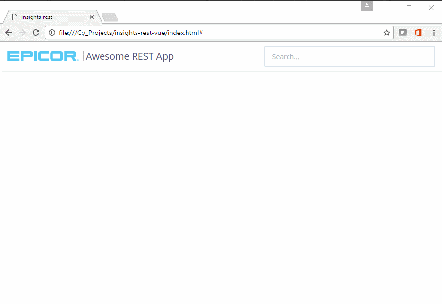

# Sample ERP Web Application 

This application is an educational sample with which you can search for any type
of business object in ERP using REST Services. 

## How this application is written

We've used Vue.js, a light weight web framework, to simplify writing data to the
web page after it is loaded from REST. This may seem complicated, but it's 
simpler than using JQuery or plain javascript to update the html, we promise! 

Since this course is about learning what you can do with Epicor ERP's REST 
services we've written most of the javascript, css, and html code for you 
already. More information on how the application works is found inline in the 
code within index.html, app.css, and most importantly app.js.

## Running the Application

This is a standalone web application that can be run without a web server
directly from the file system. All you have to do is open up index.html in a
modern web browser such as Edge, Chrome, or Firefox. Alternatively you can host
the application in the web server of your choice, but it's not necessary to
play with the application in most cases.

